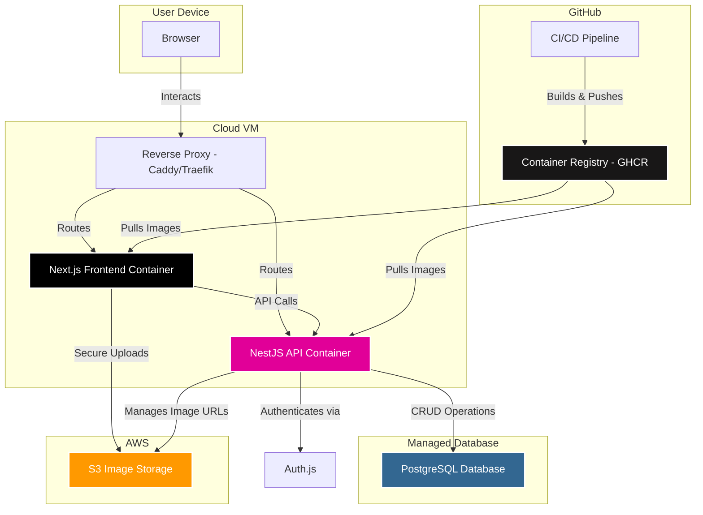

# Isntgram Fullstack Architecture Document - High Level Architecture

## High Level Architecture

### Technical Summary

The architecture for Isntgram is a modern, full-stack monorepo designed for performance, scalability, and
cost-efficiency. The system features a Next.js frontend and NestJS API backend, both containerized using Docker and
deployed on cost-effective cloud infrastructure. The application uses GitHub Container Registry (GHCR) for image storage
and automated CI/CD pipelines for reliable deployments. The backend communicates with a managed PostgreSQL database, and
user authentication is managed by Auth.js. Image assets are stored in AWS S3. This architecture directly supports the
PRD goals of creating a high-fidelity, portfolio-ready application with a focus on clean patterns, seamless developer
experience, and cost-effective production deployment.

### Platform and Infrastructure Choice

**Platform**: Docker Containers on Cost-Effective Cloud VM

**Key Services**:

- GitHub Container Registry (GHCR): Container image storage and distribution
- Cloud VM Provider (Hetzner/DigitalOcean): Application hosting
- Managed PostgreSQL (Neon/Supabase): Database hosting
- AWS S3: Image storage
- Cloudflare: DNS, CDN, and security
- Caddy/Traefik: Reverse proxy with automatic SSL

**Deployment Host and Regions**:

- Application: Cloud VM (Hetzner CX11 ~€4-5/mo or DigitalOcean $6/mo)
- Database: Managed PostgreSQL (Neon/Supabase free tier)
- CDN: Cloudflare global network

**Rationale**: This Docker-based approach provides maximum control, cost efficiency, and scalability while maintaining
modern deployment practices. Using containerization ensures consistent environments across development and production.
The choice of cost-effective cloud providers keeps monthly costs under $10 while providing reliable infrastructure.
GitHub Container Registry integrates seamlessly with our CI/CD pipeline and provides secure, private image storage.

### Repository Structure

**Structure**: Monorepo

- **Monorepo Tool**: npm workspaces
- **Package Organization**: Applications will be organized under an `apps/` directory (e.g., `apps/web`, `apps/api`),
  and shared code (e.g., types, validation schemas) will be in a `packages/` directory.

### High Level Architecture Diagram

### Architectural and Design Patterns

- **Containerized Microservices**: The frontend and backend are deployed as separate Docker containers, enabling
  independent scaling, deployment, and maintenance while maintaining the benefits of a monorepo for development.

- **Reverse Proxy Pattern**: A reverse proxy (Caddy/Traefik) handles SSL termination, routing, and load balancing,
  providing a single entry point for all traffic and automatic SSL certificate management.

- **Repository Pattern**: The backend will use the repository pattern to abstract data access logic. This decouples
  business logic from the data source, which is critical for meeting our strict TDD and 95%+ test coverage requirement.

- **Component-Based UI**: The frontend will be built as a collection of reusable React components, adhering to the UI/UX
  specification. This ensures a consistent, maintainable, and scalable user interface.

- **Infrastructure as Code**: Docker Compose and bootstrap scripts ensure consistent environment setup and deployment
  across different stages (development, staging, production).

### Cost Analysis

**Monthly Costs (Estimated)**:

- Cloud VM: €4-6/mo (Hetzner CX11 or DigitalOcean $6/mo)
- Managed Database: Free tier (Neon/Supabase)
- Container Registry: Free (GHCR)
- CDN/DNS: Free (Cloudflare)
- S3 Storage: ~$0.50/mo for typical usage
- **Total**: ~€5-7/mo (~$6-8/mo)

This architecture provides enterprise-grade reliability and scalability while maintaining the strict sub-$20/month
budget requirement.
