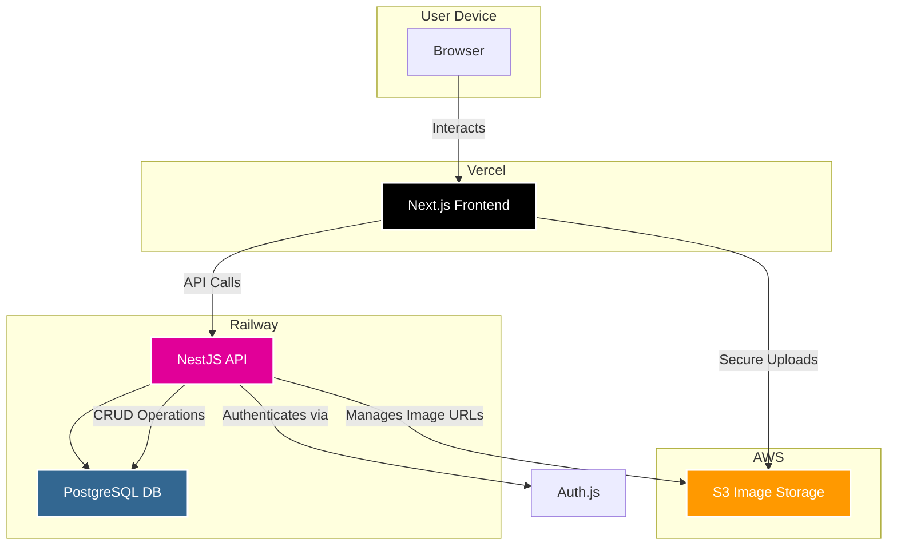

# Isntgram Fullstack Architecture Document - High Level Architecture

## High Level Architecture

### Technical Summary

The architecture for Isntgram is a modern, full-stack monorepo designed for performance, scalability, and cost-efficiency. The system features a Next.js frontend hosted on Vercel for optimal performance and user experience, communicating with a monolithic NestJS API backend. The backend will be containerized and deployed on Railway, which will also host the PostgreSQL database. This platform choice is driven by the strict sub-$20/month budget. User authentication is managed by Auth.js, and image assets are stored in AWS S3. This architecture directly supports the PRD goals of creating a high-fidelity, portfolio-ready application with a focus on clean patterns and a seamless developer experience.

### Platform and Infrastructure Choice

**Platform**: Vercel (Frontend) & Railway (Backend/Database)

**Key Services**:

- Vercel: Next.js Hosting, Edge Network/CDN
- Railway: Docker Container Hosting, PostgreSQL Database
- AWS: S3 for image storage

**Deployment Host and Regions**:

- Vercel: Global Edge Network
- Railway/AWS: us-east-1 (or nearest cost-effective region)

**Rationale**: This hybrid-platform approach is optimized for our specific technology stack and budget. Vercel provides best-in-class performance and a seamless deployment experience for Next.js applications with a generous free tier. Railway offers a simple, Git-based deployment workflow for containerized applications like our NestJS backend and includes a free-tier PostgreSQL database, making it highly cost-effective and developer-friendly. This combination allows us to leverage premier services while staying comfortably within the project's budget constraints.

### Repository Structure

**Structure**: Monorepo

- **Monorepo Tool**: npm workspaces
- **Package Organization**: Applications will be organized under an `apps/` directory (e.g., `apps/web`, `apps/api`), and shared code (e.g., types, validation schemas) will be in a `packages/` directory.

### High Level Architecture Diagram

### Architectural and Design Patterns

- **Jamstack Architecture**: The frontend will be built following Jamstack principles, utilizing Next.js to pre-render static assets and interface with the backend API, ensuring optimal performance and scalability.

- **Monolithic API**: The backend will be a single, cohesive NestJS application. This simplifies development and deployment for the MVP while maintaining internal modularity for potential future evolution.

- **Repository Pattern**: The backend will use the repository pattern to abstract data access logic. This decouples business logic from the data source, which is critical for meeting our strict TDD and 95%+ test coverage requirement.

- **Component-Based UI**: The frontend will be built as a collection of reusable React components, adhering to the UI/UX specification. This ensures a consistent, maintainable, and scalable user interface.
