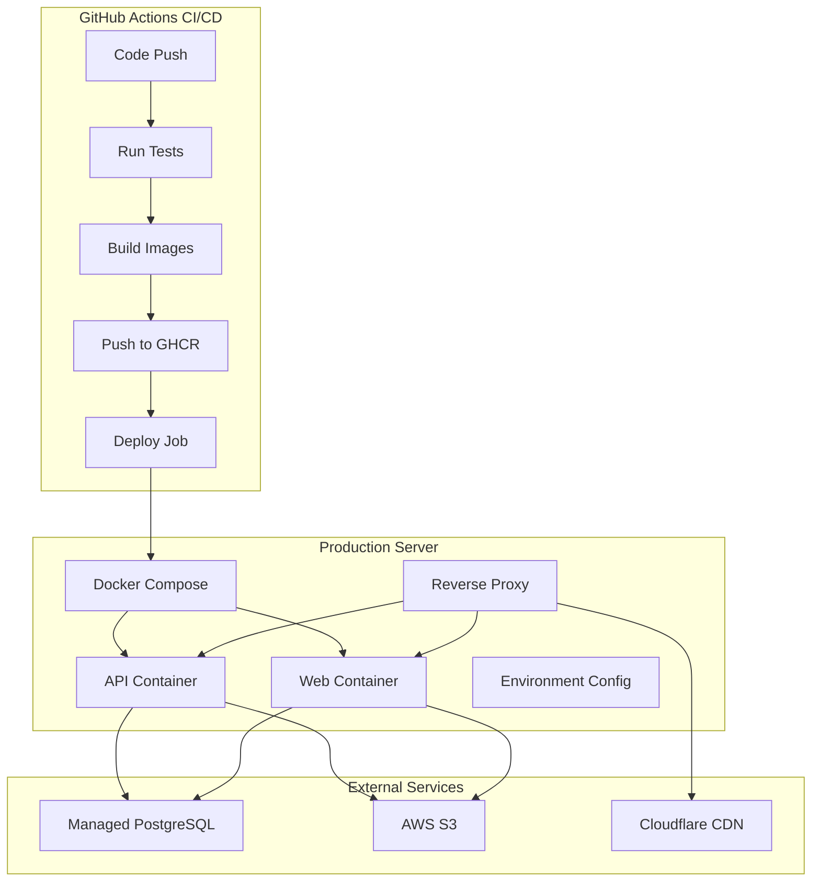

# Isntgram Fullstack Architecture Document - Deployment & Infrastructure

## Deployment & Infrastructure Strategy

### Overview

The deployment strategy for Isntgram uses Docker containers with GitHub Container Registry (GHCR) and cost-effective
cloud infrastructure to provide reliable, scalable, and maintainable production deployments while staying within budget
constraints.

### Infrastructure Components

#### 1. Container Registry

- **GitHub Container Registry (GHCR)**: Free, private container registry
- **Image Naming**: `ghcr.io/{owner}/{repo}/{service}:{tag}`
- **Tags**: `latest`, `{commit-sha}`, `{environment}-{version}`
- **Security**: Integrated with GitHub security features and vulnerability scanning

#### 2. Cloud Infrastructure

- **Primary Host**: Cost-effective cloud VM (Hetzner CX11 ~€4-5/mo or DigitalOcean $6/mo)
- **Specifications**: 2GB RAM, 1 vCPU, 20GB SSD (minimum)
- **Operating System**: Ubuntu 22.04 LTS
- **Location**: EU/US regions for optimal latency

#### 3. Database

- **Provider**: Managed PostgreSQL (Neon or Supabase)
- **Plan**: Free tier (shared instance, 1GB storage)
- **Backup**: Automated daily backups included
- **Scaling**: Easy upgrade path as needed

#### 4. Reverse Proxy & SSL

- **Solution**: Caddy or Traefik
- **SSL**: Automatic Let's Encrypt certificates
- **Features**: HTTP/2, automatic redirects, security headers
- **Routing**: Path-based routing to frontend/backend containers

#### 5. CDN & DNS

- **Provider**: Cloudflare (free tier)
- **Features**: Global CDN, DDoS protection, DNS management
- **SSL**: Full SSL encryption
- **Caching**: Static asset caching

### Deployment Architecture



### CI/CD Pipeline

#### Build Phase

1. **Code Quality**: ESLint, Prettier, markdownlint
2. **Testing**: Unit, integration, E2E tests with coverage
3. **Security**: CodeQL, Gitleaks, Trivy container scanning
4. **Build**: Multi-stage Docker builds with Buildx caching
5. **Push**: Images tagged and pushed to GHCR

#### Deploy Phase

1. **Approval**: Manual approval gate for production
2. **SSH**: Connect to production server
3. **Pull**: Pull latest images from GHCR
4. **Update**: Docker Compose up with new images
5. **Health Check**: Validate deployment success
6. **Rollback**: Automatic rollback on failure

### Docker Configuration

#### Multi-Stage Build (Dockerfile.prod)

```dockerfile
# Build stage
FROM node:18-alpine AS builder
WORKDIR /app
COPY package*.json ./
RUN npm ci --only=production
COPY . .
RUN npm run build:all

# Production stage
FROM node:18-alpine AS production
WORKDIR /app
COPY --from=builder /app/dist ./dist
COPY --from=builder /app/node_modules ./node_modules
COPY --from=builder /app/package*.json ./
USER node
EXPOSE 3000
HEALTHCHECK --interval=30s --timeout=3s --start-period=5s --retries=3 \
  CMD curl -f http://localhost:3000/health || exit 1
CMD ["npm", "start"]
```

#### Docker Compose (docker-compose.prod.yml)

```yaml
version: "3.8"
services:
  web:
    image: ghcr.io/owner/repo/web:latest
    ports:
      - "3000:3000"
    environment:
      - NODE_ENV=production
      - DATABASE_URL=${DATABASE_URL}
    depends_on:
      - api
    restart: unless-stopped

  api:
    image: ghcr.io/owner/repo/api:latest
    ports:
      - "3001:3001"
    environment:
      - NODE_ENV=production
      - DATABASE_URL=${DATABASE_URL}
      - JWT_SECRET=${JWT_SECRET}
    restart: unless-stopped

  reverse-proxy:
    image: caddy:2-alpine
    ports:
      - "80:80"
      - "443:443"
    volumes:
      - ./Caddyfile:/etc/caddy/Caddyfile
      - caddy_data:/data
      - caddy_config:/config
    restart: unless-stopped

volumes:
  caddy_data:
  caddy_config:
```

### Security Considerations

#### Container Security

- Non-root user execution
- Minimal base images (Alpine Linux)
- Regular security updates
- Vulnerability scanning with Trivy
- Secrets management via environment variables

#### Network Security

- Firewall configuration (UFW)
- SSH key-based authentication only
- Regular security updates
- HTTPS enforcement
- Security headers implementation

#### Data Security

- Encrypted database connections
- S3 bucket encryption
- Regular backups
- Access logging and monitoring

### Monitoring & Observability

#### Health Checks

- Application health endpoints (`/health`)
- Database connectivity checks
- External service availability
- Automated alerting on failures

#### Logging

- Structured JSON logging
- Log aggregation and rotation
- Error tracking and alerting
- Performance metrics collection

#### Metrics

- Application performance metrics
- Resource utilization monitoring
- Error rates and response times
- User activity analytics

### Backup & Disaster Recovery

#### Backup Strategy

- **Database**: Daily automated backups (managed provider)
- **Configuration**: Version controlled in Git
- **User Data**: S3 bucket versioning enabled
- **Server State**: VM snapshots (monthly)

#### Recovery Procedures

- **RTO**: 15 minutes (automated deployment)
- **RPO**: 24 hours (daily backups)
- **Rollback**: Previous image deployment
- **Data Recovery**: Point-in-time restoration

### Cost Optimization

#### Current Monthly Costs

- **VM Hosting**: €4-6/mo
- **Database**: Free tier
- **Container Registry**: Free
- **CDN/DNS**: Free (Cloudflare)
- **S3 Storage**: ~$0.50/mo
- **Total**: ~€5-7/mo

#### Scaling Considerations

- **Vertical Scaling**: Upgrade VM specs as needed
- **Horizontal Scaling**: Add load balancer and multiple VMs
- **Database**: Upgrade to paid tier for more resources
- **CDN**: Upgrade Cloudflare plan for advanced features

### Deployment Procedures

#### Initial Setup

1. Provision cloud VM
2. Run bootstrap script for server setup
3. Configure DNS and SSL certificates
4. Deploy initial application version
5. Verify health checks and monitoring

#### Regular Deployments

1. Push code to main branch
2. CI pipeline runs tests and builds images
3. Manual approval for production deployment
4. Automated deployment to production
5. Health check validation
6. Rollback on failure

#### Rollback Procedures

1. Identify failed deployment
2. Revert to previous image tag
3. Update Docker Compose configuration
4. Restart services with previous version
5. Verify application health
6. Investigate and fix issues

### Future Enhancements

#### Phase 2 Improvements

- **Load Balancing**: Multiple application instances
- **Auto-scaling**: Based on traffic patterns
- **Blue-Green Deployments**: Zero-downtime updates
- **Advanced Monitoring**: APM and distributed tracing
- **Infrastructure as Code**: Terraform or Pulumi

#### Phase 3 Scaling

- **Kubernetes**: Container orchestration
- **Microservices**: Service decomposition
- **Service Mesh**: Istio or Linkerd
- **Multi-region**: Global deployment
- **Advanced Security**: WAF, DDoS protection
