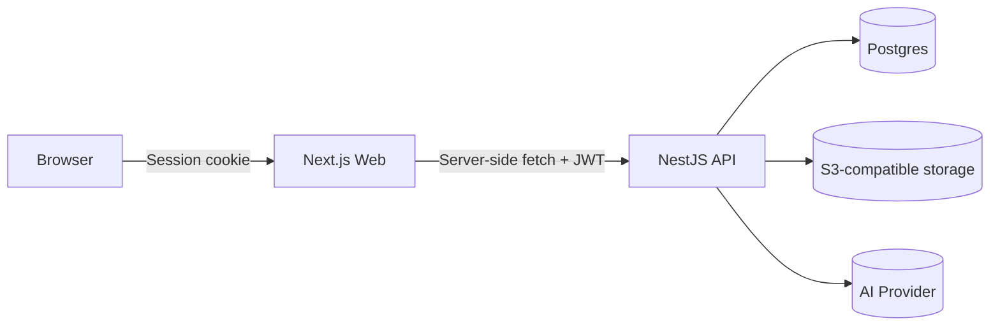

# System Design — Overview

## Architecture

## Core principles

- **Single source of truth for auth:** The API verifies JWTs; the web app never sends user IDs as proof.
- **BFF pattern:** Next.js route handlers attach API tokens server-side; tokens never reach the browser.
- **Contracts are generated:** TypeScript contract types are generated from the API’s OpenAPI spec, and `openapi-fetch`
  clients use those types end-to-end.
- **Stateless services:** Web and API services scale horizontally behind a load balancer.

## Request flow (typical)

1. User signs in on the web app.
2. Auth.js calls the API `/api/auth/login` and stores the API JWT inside the encrypted Auth.js JWT cookie (HTTP-only;
   not exposed to browser JavaScript).
3. When the UI needs data, the Web server calls the API with `Authorization: Bearer <jwt>`.
4. API guards authorize based on the JWT payload and return data.

## Why this design

- Keeps credentials and tokens off the client.
- Aligns with modern Next.js patterns (server components + route handlers).
- Easy to scale: Web/API are stateless; storage is external.
