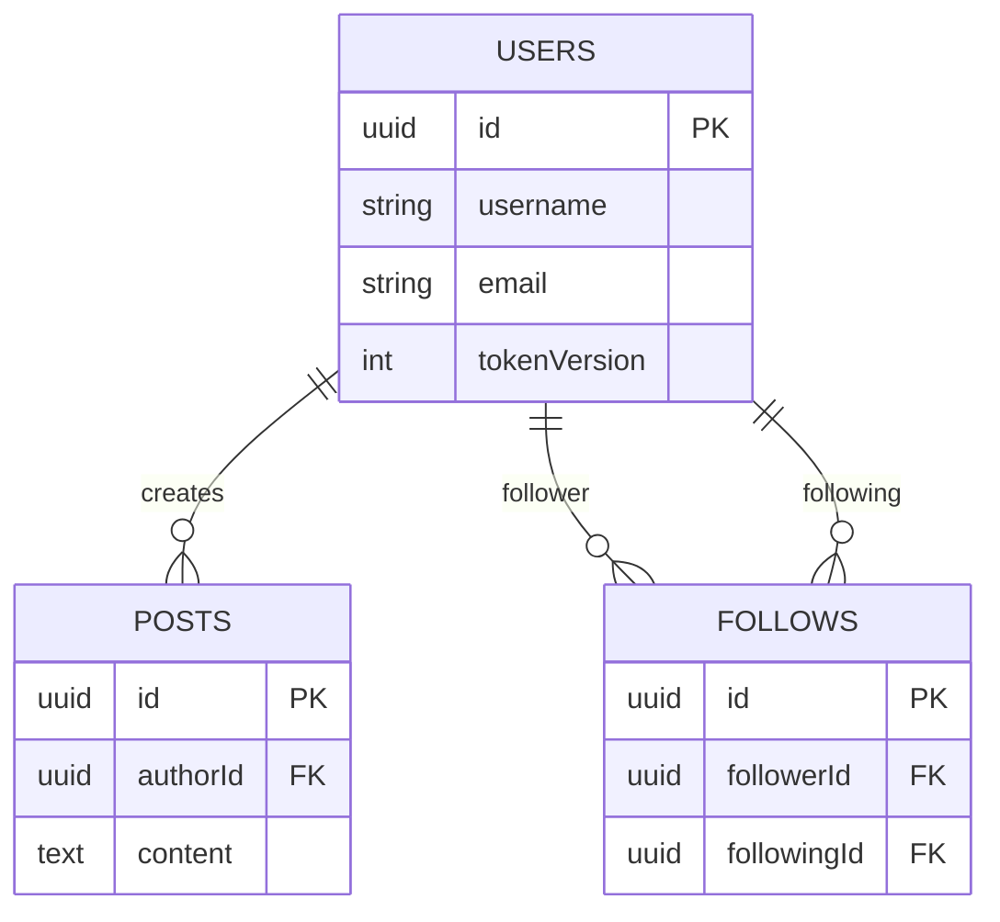

# System Design — Data Model

## Tables



### users

- `id` (uuid, pk)
- `username` (unique)
- `fullName`
- `email` (unique)
- `hashedPassword`
- `tokenVersion` (revocation counter for API JWTs)
- `profilePictureUrl` (nullable)
- `bio` (nullable)
- `postsCount`, `followerCount`, `followingCount`
- `createdAt`, `updatedAt`

### posts

- `id` (uuid, pk)
- `authorId` (fk → users.id)
- `content`
- `mediaUrl` (nullable)
- `createdAt`, `updatedAt`

### follows

- `id` (uuid, pk)
- `followerId` (fk → users.id)
- `followingId` (fk → users.id)
- `createdAt`

## Relationships

```text
users 1 ──── * posts
users 1 ──── * follows (as follower)
users 1 ──── * follows (as following)
```

## Key indexes

- `users(username)`
- `users(email)`
- `posts(authorId, createdAt)`
- `follows(followerId, createdAt)`
- `follows(followingId, createdAt)`

## Notes

- Usernames and emails are normalized (trimmed/lowercased) at the API boundary.
- Follow counts are updated transactionally on follow/unfollow.
- Post counts are updated transactionally on create (future: decrement on delete).
- A maintenance script exists to reconcile denormalized counters if they drift (e.g., admin deletes/backfills):
  `pnpm --filter api counts:reconcile`
- Demo accounts are marked with `isDemoUser` + `demoExpiresAt` and can be deleted via: `pnpm --filter api demo:cleanup`
