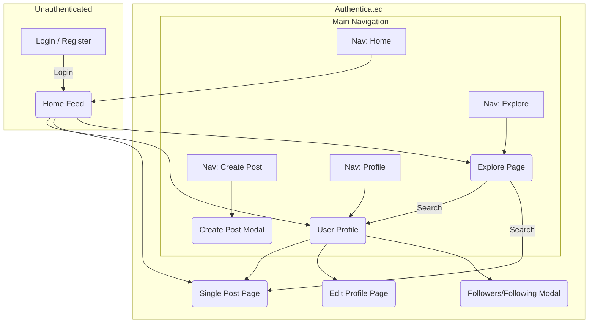

# Isntgram UI/UX Specification

## 1. Overall UX Goals & Principles

### 1.1. Target User Personas

#### Primary Persona: The Evaluator (Recruiters & Hiring Managers)

**Profile**: Time-constrained professionals scanning for talent.

**Goal**: To efficiently assess project complexity, code quality, and a candidate's skills.

**Needs**: A live, frictionless demo, clear functionality, and an impressive, polished UI. They value speed and ease of
access above all.

#### Secondary Persona: The Reviewer (Peer Developers & Architects)

**Profile**: Technical experts evaluating code and architecture.

**Goal**: To assess technical depth, maintainability, and adherence to best practices.

**Needs**: Well-structured, readable code, comprehensive tests, and clear documentation that explains the "why" behind
decisions.

### 1.2. Usability Goals

- **Frictionless Evaluation**: A recruiter must be able to access the live demo and understand the project's quality in
  under 5 minutes.
- **Efficiency of Use**: The UI should feel fast and responsive, with a focus on smooth infinite scrolling and immediate
  feedback.
- **Ease of Learning**: The interface should be intuitive, mimicking established social media patterns.
- **High Performance**: Target a Lighthouse performance score of 90+.

### 1.3. Core Design Principles

- **Clarity over Cleverness**: Prioritize clear, intuitive layouts over novel or complex designs.
- **Fidelity & Polish**: The UI must feel like a real, production-grade application with attention to detail.
- **Accessible by Default**: Design and build to meet WCAG 2.1 AA standards from the start.
- **Guided Discovery**: The UI and documentation should make it easy to discover the underlying quality of the work.

## 2. Information Architecture (IA)

### 2.1. Site Map

### 2.2. Navigation Structure

- **Primary Navigation**: A persistent bar providing access to Home, Explore, Create Post, and Profile.
- **Secondary Navigation**: Contextual links (e.g., clicking a username).
- **Breadcrumb Strategy**: Not required; primary navigation will provide constant orientation.

## 3. User Flows

- **User Registration**: A standard flow from a "Sign up" link to a form, API submission, and redirect to login on
  success.
- **User Login & Demo Access**: A login page with two paths: standard email/password login or a one-click "Try our demo"
  button.
- **Create a New Post**: A modal-based flow to select an image, upload it, write a caption, and share to the feed.
- **Post Engagement**: In-feed actions (Like, Comment, Follow) provide immediate optimistic UI updates with API calls in
  the background.
- **Main Feed & Infinite Scroll**: The default view for logged-in users, automatically fetching older posts as the user
  scrolls.
- **Explore & Search**: An explore page with a search bar to find users and posts by hashtags.
- **Edit Profile**: A modal or page where users can update their own information.
- **Delete Content**: A confirmation-based flow to allow users to delete their own posts or comments.

## 4. Screen Layouts

### 4.1. Login Screen

**Purpose**: Secure sign-in, registration path, and demo mode access.

**Key Elements**: Logo, input fields (email, password), "Log In" button, "Try our demo" button, "Sign up" link, and a
footer with links to your GitHub and personal dev site.

### 4.2. Registration Screen

**Purpose**: New user account creation.

**Key Elements**: Logo, tagline, input fields (email, full name, username, password), "Sign Up" button, "Log in" link,
and the same footer links.

### 4.3. Main Feed (Home Screen)

**Purpose**: Primary, infinitely scrolling feed of posts.

**Key Elements**: Main navigation, a single column of post components (each with header, image, action bar, caption,
etc.), and a loading spinner for infinite scroll.

### 4.4. User Profile Page

**Purpose**: Display user information and their grid of posts.

**Key Elements**: Profile header (avatar, username, follow/edit button, stats) and a grid of post thumbnails.

### 4.5. Single Post Detail Page

**Purpose**: Focused view of a single post and its comments.

**Key Elements**: A two-column layout on desktop (image on left, details/comments on right) and a single-column layout
on mobile.

### 4.6. Explore Page

**Purpose**: Discovery of new content and users.

**Key Elements**: Prominent search bar and a masonry grid of post thumbnails.

### 4.7. Edit Profile Page

**Purpose**: Allow users to modify their personal information.

**Key Elements**: A simple form with fields for "Full Name" and "Username".

## 5. Responsiveness Strategy

- **Mobile-First Approach**: Layouts are designed for mobile first, then adapted for larger screens.
- **Breakpoints**: Mobile (<768px), Tablet (768px-1024px), Desktop (>1024px).
- **Navigation**: The primary navigation bar will be at the bottom on mobile and at the top on desktop/tablet.

## 6. Component Library / Design System

- **Foundation**: Shadcn/ui base components; Tailwind CSS for styling; icons via Lucide or Remix Icons.
- **Theming Tokens**:
  - Neutrals: bg #FFFFFF, surface #F9FAFB, border #E5E7EB, text #111827/#6B7280
  - Primary: Blue #3B82F6 (hover #2563EB)
  - Radius: 8/12
  - Effects: subtle borders + light shadows
- **Core Components (visual)**:
  - Buttons: primary blue, secondary white/gray, destructive red
  - Inputs: gray border, blue focus ring
  - Cards: white, 1px border, radius 12
  - Modals: radius 12, overlay 60%
  - Avatars: 24–64, optional ring
  - Toasts: top-right
  - Skeletons: shimmer

## 7. Branding & Style Guide

- **Aesthetic**: Clean, light, friendly; "Instagram-adjacent" without cloning. Subtle gradients, soft neutrals,
  restrained motion. Informed by the legacy app’s white nav bars and thin borders.
- **Color Palette**:
  - Neutrals: bg #FFFFFF, surface #F9FAFB, border #E5E7EB, text #111827/#6B7280/#9CA3AF
  - Primary: Blue #3B82F6 (hover/active #2563EB)
  - Accents: Indigo #6366F1, Pink #EC4899, Purple #8B5CF6; Status: Success #10B981, Warn #F59E0B, Danger #EF4444
- **Typography**: Geist Sans (preferred) → Inter/System fallback; 16px base; headings 500–600, body 400.
- **Iconography**: Lucide/Remix line icons, 1.5–2px strokes, 16/20/24 sizes.
- **Navigation style**: Desktop top bar and mobile bottom bar remain white with a thin gray border; active state uses
  primary blue.
- **Dark Mode (draft)**: Background #0B0F19, surface #111827, text #E5E7EB/#9CA3AF, borders #1F2937, primary shifts to
  #60A5FA (hover #93C5FD).

## 8. Notifications & Feedback

- **Toasts**: Top-right placement; success green, error red, neutral gray; 3–5s auto-close; avoid blocking actions.
- **Inline Errors**: Field-level messages directly below inputs; error color #EF4444; keep copy concise and specific.
- **Focus & States**: Visible 2px blue ring on interactive elements; disabled states use ~60% opacity.

## 9. Animation & Micro-interactions

- **Principle**: Subtle and purposeful; respect reduced motion preferences.
- **Durations/Easing**: 150–250ms for hover/focus; 180–220ms for modals; ease-out on enter, ease-in on exit.
- **Patterns**: Modal fade + 98%→100% scale; icon tap “pop” (0.98→1); list items fade-in; skeleton shimmer L→R
  (~1200ms).

## 10. Performance Considerations

- **Goal**: Lighthouse score of 90+.
- **Strategies**: Automatic image optimization/compression and lazy loading for images in the feed.
